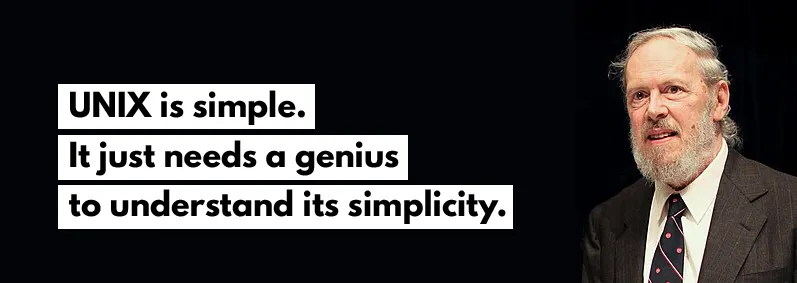

<div align="center">

# Unix-cli

This project is aimed at creating a simple shell, similar to Bash. This project enhanced my understanding of processes and file descriptors in Unix-like operating systems. 



### How to use it
</div>

```bash
git clone https://github.com/2iaad/Unix-cli 2iaad && cd 2iaad && make && ./minishell
```

<br></br>


<div align='center'>
<h1>Overview</h1>
</div>

Unix-cli is *a program that mimics the behavior of a command-line interpreter*, accepting and executing commands while offering core shell functionalities. Designed to follow *Unix* standards, it handles parsing, redirections, pipes, and some built-in commands, providing an educational experience in building a CLI from scratch and understanding how commands are executed behind the scenes.

Key Shell Functionalities
-------------------------

### 1. Parsing and Execution Flow

Unix-cli’s parsing system involves tokenizing input, recognizing built-in and external commands, and handling arguments and operators. This includes:


<div align='center'>


</div>

1.  **Lexical Analysis**: Breaking down commands using `libft` functions (e.g., `ft_split`), managing quotes, special characters, and whitespace.
2.  **Syntax Parsing**: Identifying commands, arguments, and operators like pipes (`|`) and redirections (`>`, `<`).
3.  **Execution Handling**: Executing built-in commands or external programs using `execve`.

<div align='center'>


</div>

### 2. Redirections and Pipes

Unix-cli implements pipes and redirections to link commands and manage I/O efficiently.
Lets take this example:

<div align='center'>
  <h3>ls | sort | tail | awk</h3><br>


</div>

*   **Redirection Management**: Sets up file descriptors to redirect input/output as needed, using `dup2` to remap them for specific commands.
*   **Pipes**: Links multiple commands, passing output from one command as input to the next using file descriptors.

### 3. Signal Handling

Unix-cli responds to Unix signals (`SIGINT`, `SIGQUIT`) to manage command interruption and keep the interface responsive. We can say that it just an action that can be done depending on a signal thrown.

<div align='center'>


</div>

*   **Command Interruption**: Stops currently executing commands without crashing the shell.
*   **Prompt Control**: Clears and redisplays the prompt on specific signals.

* * *

### What i have learned

Developing and using essential programming concepts like memory management, IPC (inter process communication), formatted output, and file I/O. This project game me programming skills that im pretty sure will help build larger projects.

Thanks for reading sa7bi ;) Enjoy!